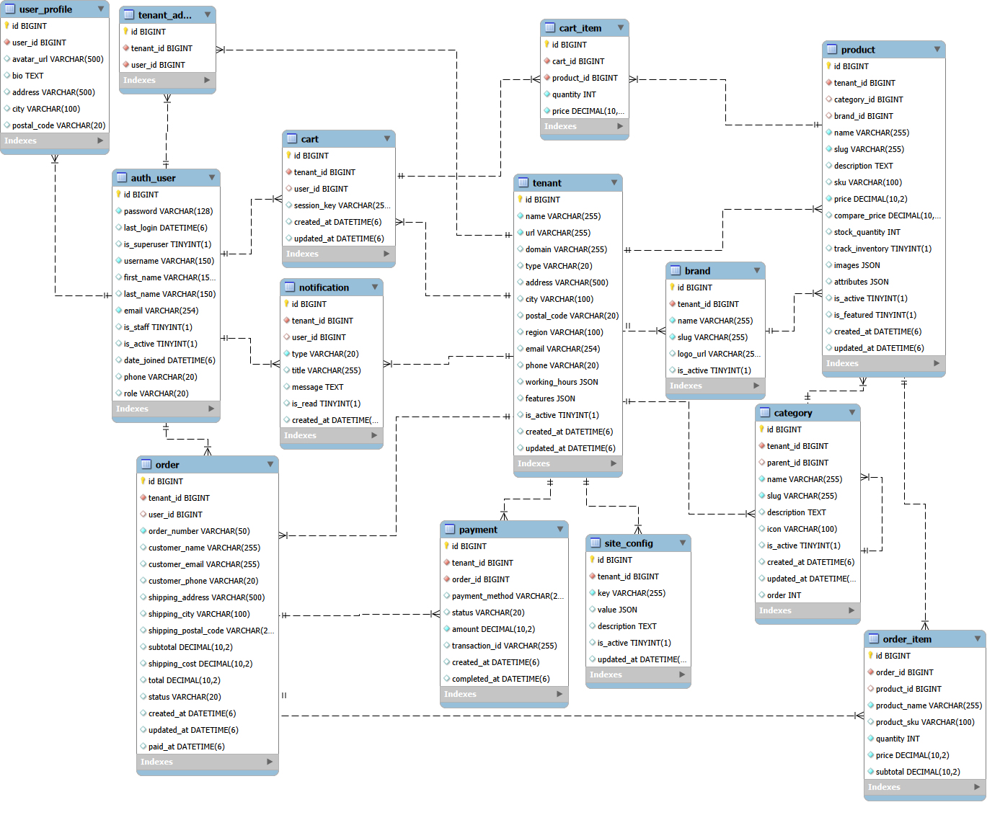

# База данных для ПВЗ (Пункт выдачи заказов)


>[!TIP]
+ [Типовые запросы](#Типовые-запросы)
* [Хранимые процедуры](#Хранимые-процедуры)
+ [Функции](#Функции)
+ [Представления](#Представления)
+ [Триггеры](#Триггеры)
+ [Роли и права доступа](#Роли-и-права-доступа)

> [!IMPORTANT]
> ## Для разворачивания БД и тестовых данных необходимо скачать и инициализировать файл dump.sql

---

> [!IMPORTANT]
> ## Типовые запросы:

### Заказы, которые уже доставлены на ПВЗ и ждут получения:

```sql
SELECT
    o.order_number          AS номер_заказа,
    t.name                  AS пвз,
    t.city                  AS город,
    o.customer_name         AS покупатель,
    o.customer_phone        AS телефон,
    o.total                 AS сумма,
    o.updated_at            AS дата_поступления_на_пвз
FROM `order` o
JOIN tenant t ON o.tenant_id = t.id
WHERE o.status   = 'delivered'
  AND t.id       = 1
ORDER BY o.updated_at ASC;
```

### Товары, которых нет в наличии:

```sql
SELECT
    t.name                  AS пвз,
    p.name                  AS товар,
    p.sku                   AS артикул,
    p.price                 AS цена,
    p.stock_quantity        AS остаток
FROM product p
JOIN tenant t ON p.tenant_id = t.id
WHERE p.stock_quantity = 0
  AND p.is_active      = 1
  AND t.id             = 1
ORDER BY p.name;
```

### Заказы за конкретный месяц:

```sql
SELECT
    o.order_number          AS номер_заказа,
    t.name                  AS пвз,
    o.customer_name         AS покупатель,
    o.total                 AS сумма,
    o.status                AS статус,
    o.created_at            AS дата
FROM `order` o
JOIN tenant t ON o.tenant_id = t.id
WHERE YEAR(o.created_at)  = 2024
  AND MONTH(o.created_at) = 3
  AND t.id                = 1
ORDER BY o.created_at;
```

### История платежей конкретного ПВЗ:

```sql
SELECT
    o.order_number          AS номер_заказа,
    o.customer_name         AS покупатель,
    p.payment_method        AS способ_оплаты,
    p.amount                AS сумма,
    p.status                AS статус_платежа,
    p.completed_at          AS дата_оплаты
FROM payment p
JOIN `order` o ON p.order_id  = o.id
JOIN tenant  t ON p.tenant_id = t.id
WHERE t.id = 1
ORDER BY p.created_at DESC;
```

### Средний чек конкретного ПВЗ:

```sql
SELECT
    t.name                  AS пвз,
    COUNT(o.id)             AS всего_заказов,
    MIN(o.total)            AS мин_чек,
    MAX(o.total)            AS макс_чек,
    ROUND(AVG(o.total), 2)  AS средний_чек
FROM `order` o
JOIN tenant t ON o.tenant_id = t.id
WHERE t.id = 1
  AND o.status != 'cancelled';
```

---

> [!IMPORTANT]
> ## Представления:

### Представление `vw_pvz_parcels` объединяет данные из нескольких таблиц и предоставляет комплексную информацию о посылках на ПВЗ, включая статус хранения и признак просрочки:

```sql
SELECT * FROM pvzbd.vw_pvz_parcels;
```

> Представление включает:
- Человекочитаемое описание статуса заказа
- Количество дней нахождения посылки на ПВЗ
- Флаг просрочки хранения (более 7 дней)

---

> [!IMPORTANT]
> ## Хранимые процедуры:

### `sp_cancel_order` — отмена заказа

### Данная хранимая процедура содержит:
- Обработчик исключений
* Транзакцию
+ Условия валидации входных параметров

```sql
-- Пример отмены заказа (id=5) на ПВЗ (id=1) с указанием причины
CALL pvzbd.sp_cancel_order(5, 1, 'Клиент отказался от получения');
```

> Процедура проверяет:
- Корректность ID заказа
- Наличие причины отмены
- Что заказ существует и принадлежит данному ПВЗ
- Что заказ ещё не выдан и не отменён

> При успешной отмене:
- Устанавливает статус заказа `cancelled`
- Отменяет незавершённые платежи
- Отправляет уведомление клиенту с информацией о возврате средств

---

> [!IMPORTANT]
> ## Функции:

### `fn_calc_shipping` — расчёт стоимости доставки

Функция читает порог бесплатной доставки из конфигурации ПВЗ и возвращает стоимость доставки.

```sql
-- Сумма ниже порога — доставка платная (350 руб.)
SELECT fn_calc_shipping(1, 3000.00) AS ship_cost_low;

-- Сумма выше порога — доставка бесплатна (0 руб.)
SELECT fn_calc_shipping(1, 6000.00) AS ship_cost_high;
```

```sql
-- Сравнение расчётной и фактической стоимости доставки по заказам ПВЗ
SELECT
    o.order_number,
    o.subtotal,
    fn_calc_shipping(o.tenant_id, o.subtotal) AS calc_shipping,
    o.shipping_cost                            AS actual_shipping
FROM `order` o
WHERE o.tenant_id = 1
LIMIT 5;
```

---

> [!IMPORTANT]
> ## Триггеры:

### `trg_before_product_update` — защита от отрицательного остатка товара

Триггер срабатывает перед обновлением таблицы `product` и блокирует установку отрицательного количества товара на складе.

```sql
BEFORE UPDATE ON product
FOR EACH ROW
BEGIN
    IF NEW.stock_quantity < 0 THEN
        SIGNAL SQLSTATE '45000'
            SET MESSAGE_TEXT = 'Остаток товара не может быть отрицательным',
                MYSQL_ERRNO = 1001;
    END IF;
END
```

```sql
-- Пример: попытка установить отрицательный остаток вызовет ошибку
UPDATE product SET stock_quantity = -10 WHERE id = 43;
```

---

> [!IMPORTANT]
> ## Роли и права доступа:

В базе данных определены три роли с разграниченными правами:

| Роль | Описание |
|---|---|
| `db_admin` | Полный доступ ко всем таблицам БД |
| `db_manager` | Управление товарами, заказами, уведомлениями |
| `db_customer` | Просмотр каталога, работа с корзиной и своими заказами |

```sql
-- Назначение роли пользователю
GRANT 'db_manager' TO 'имя_пользователя'@'localhost';
```
